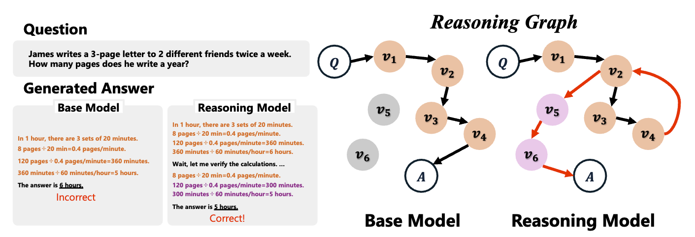

# Topology of Reasoning: Understanding Large Reasoning Models through Reasoning Graph Properties



This is the official reposaitory for paper [Topology of Reasoning: Understanding Large Reasoning Models through Reasoning Graph Properties](https://arxiv.org/abs/2506.05744).

## Setup

```bash
docker build -t topology-of-reasoning .
```

## Evaluation

```bash
bash scripts/eval.sh
```
you can get csv file in `eval_result/dataset_name/your_model/your_time`

## Cluster and visualize reasoning graph

```bash
bash scripts/cluster_generated.sh
```
you can get csv file in `extract_steps/your_model/dataset_name/target_layer_ratio=0.9`  
and visualize the reasoning graph with `extract_steps/your_model/dataset_name/target_layer_ratio=0.9/visualize`

Graph characteristics are calculated in `extract_steps/your_model/dataset_name/target_layer_ratio=0.9/results.json`

## Citation

* To cite our paper:
    ```
@misc{minegishi2025topologyreasoningunderstandinglarge,
      title={Topology of Reasoning: Understanding Large Reasoning Models through Reasoning Graph Properties}, 
      author={Gouki Minegishi and Hiroki Furuta and Takeshi Kojima and Yusuke Iwasawa and Yutaka Matsuo},
      year={2025},
      eprint={2506.05744},
      archivePrefix={arXiv},
      primaryClass={cs.AI},
      url={https://arxiv.org/abs/2506.05744}, 
}
    ```